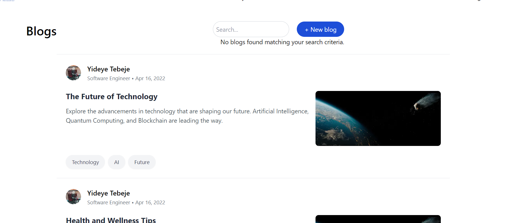
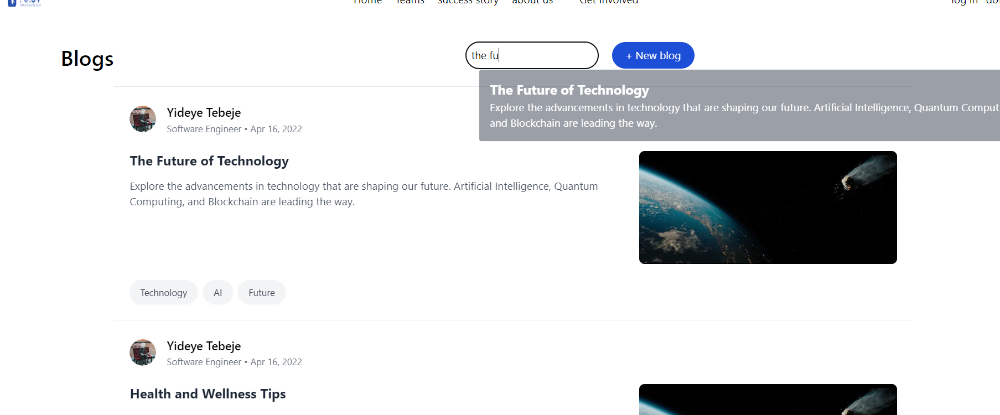
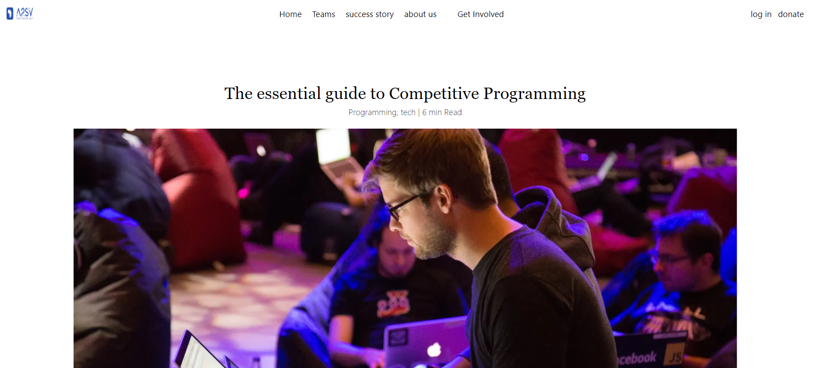
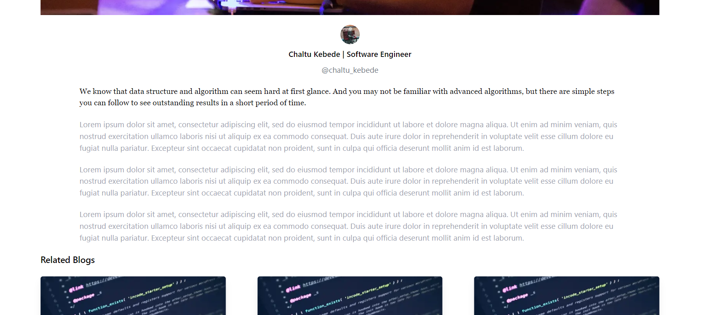
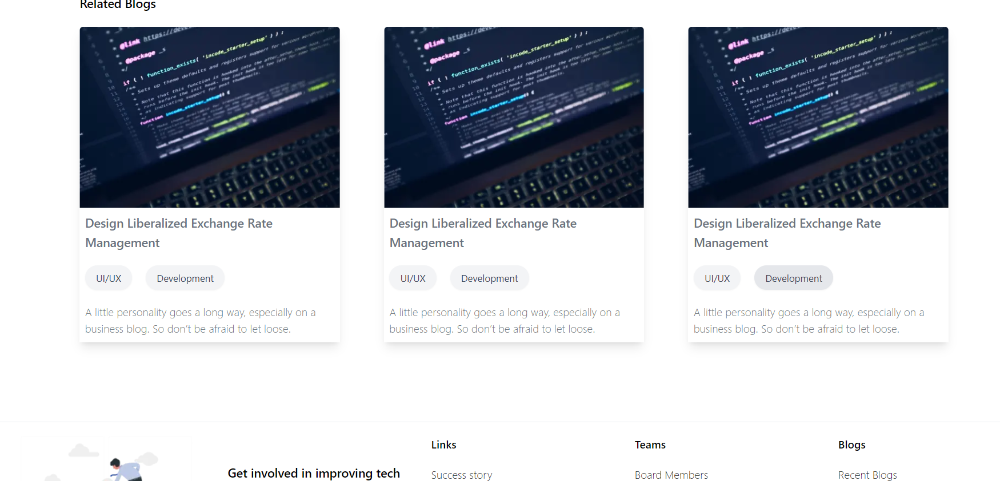

# Blog Search Application

## Overview

This project is a React-based web application that allows users to search through a list of blogs fetched from an API. The search results are displayed in a modal, providing a clean and user-friendly interface for blog exploration.

## Features

- **Blog Fetching**: Fetches a list of blogs from an external API.
  
    
- **Search Functionality**: Allows users to search blogs by title or description.
  

  

<!-- jhdjhs -->
## Technologies Used

- **React**: JavaScript library for building user interfaces.
- **Next.js**: React framework for server-side rendering and generating static websites.
- **TypeScript**: A typed superset of JavaScript that compiles to plain JavaScript.
- **Tailwind CSS**: A utility-first CSS framework for designing responsive layouts.

## Getting Started

### Prerequisites

- **Node.js**: Ensure that Node.js is installed on your system.
- **npm or yarn**: Package manager to install dependencies.

## deployed at vercel
[page link](https://g5-web-assessment-theta.vercel.app/)
